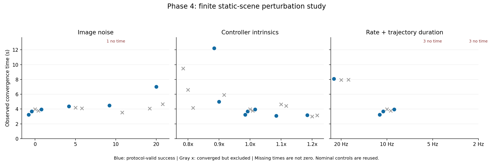
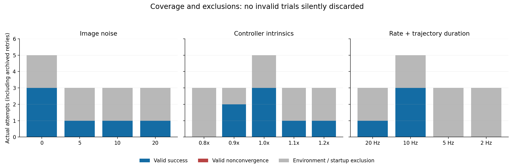

# Phase 4：有限扰动实验结果与限制

2026-10-07。本阶段完成图像噪声、控制器内参偏差、控制频率与匹配轨迹时长三类预定实验，并保留成功、未收敛和环境异常。项目定位为 ROS 2/Gazebo 学习与展示仿真，按当前范围结束 Phase 4 主线；有效重复不足和异常排查留到 Phase 5。

**必须记住：实验矩阵执行完成，不等于所有条件验证通过。本轮不足以证明广泛扰动鲁棒性。**

## 版本、控制条件与判据

- 实际执行版本为 `18d2e5762ecb97df23933351d7691101bcdd6a1a`；35 次启动时均为该提交、干净工作树。本文、参数配表和结果文件在实验结束后整理，后续提交不是历史运行版本。
- 同一世界和 URDF、同一初始姿态与静态目标；控制基线为 `lambda_gain=9.6`、`estimated_depth=2.0`、`fx=fy=554.38`、`control_rate=10.0`、`trajectory_duration=0.025`。每轮完整重启场景，自动检查准备状态和首条运动命令。
- 噪声在 BGR→HSV 前加入，各通道高斯标准差 σ=0/5/10/20，seed=1001/1002/1003；σ=0 直接使用原图。相机内参实验只改控制器 fx/fy，倍率为 0.8/0.9/1.0/1.1/1.2，实际相机保持不变。
- 频率/轨迹时长成对为 20 Hz/0.0125 s、10 Hz/0.025 s、5 Hz/0.05 s、2 Hz/0.125 s。轨迹时长与控制周期之比保持 0.25，测量的是两个绑定参数的联合影响。
- 从首条已核实运动命令起，以外部单调时钟观察 30 秒。误差范数必须严格小于 5 px，且新鲜观测连续保持至少三秒；收敛时间取合格保持区间的起点，不包含这三秒额外确认时间。
- `geometric_converged` 仅表示观测保持达标；`formal_candidate` 表示符合既定正式比较条件。时钟事件、观测过期、启动核验失败等异常单列，不事后放宽规则。正常观测超时且无异常的试验应计为有效失败。

启动核验以记录到的参数为准；三次启动超时未完成全部核验，不能声称每次均核验通过。汇总核对了请求参数与设计、世界/URDF 哈希、CSV 误差范数及正式有效样本的首条命令、保持区间和退出清理。

## 样本覆盖

预定矩阵有 33 次独立试验：共享基线 3 次、非零噪声 9 次、非标称内参 12 次、非基线频率 9 次。此前建立零扰动对照时额外运行两次异常重试，因此本固定版本队列实际保留 **35 次**。更早的开发试跑和历史基线不混入本表。后续非零噪声及另外两类实验没有自动补跑。

| 本轮唯一记录 | 数量 |
|---|---:|
| 实际尝试 | 35 |
| 达到观测误差保持条件 | 28 |
| 观察超时 | 4 |
| 启动超时 | 3 |
| 符合正式比较条件 | 11 |
| 其中有效成功 / 有效未收敛 | 11 / 0 |
| 带异常、单列保留 | 24 |

28 次保持达标中，17 次带异常、11 次有效。其余四次观察超时及三次启动超时也带异常。**11/11 不能作为整体算法成功率**：有效样本是排除异常后的子集，样本覆盖不均，低频档位没有有效样本。“有效未收敛为 0”也不等于没有观察到未收敛。

下表每个标称档位显示同一组五次对照尝试（含两次异常）；三个有效对照被三类实验共享，不是额外重复运行，不能将表中各行相加作为总次数。

| 实验组 | 条件 | 实际次数 | 达到保持 | 有效成功 | 有效未收敛 | 异常单列 | 有效成功平均收敛 / s |
|---|---|---:|---:|---:|---:|---:|---:|
| 图像噪声 σ | 0 | 5 | 5 | 3 | 0 | 2 | 3.620 |
| 图像噪声 σ | 5 | 3 | 3 | 1 | 0 | 2 | 4.360 |
| 图像噪声 σ | 10 | 3 | 2 | 1 | 0 | 2 | 4.488 |
| 图像噪声 σ | 20 | 3 | 3 | 1 | 0 | 2 | 7.017 |
| 控制器内参 | 0.8x | 3 | 3 | 0 | 0 | 3 | — |
| 控制器内参 | 0.9x | 3 | 3 | 2 | 0 | 1 | 8.605 |
| 控制器内参 | 1.0x | 5 | 5 | 3 | 0 | 2 | 3.620 |
| 控制器内参 | 1.1x | 3 | 3 | 1 | 0 | 2 | 3.102 |
| 控制器内参 | 1.2x | 3 | 3 | 1 | 0 | 2 | 3.176 |
| 频率与轨迹时长 | 20 Hz | 3 | 3 | 1 | 0 | 2 | 8.074 |
| 频率与轨迹时长 | 10 Hz | 5 | 5 | 3 | 0 | 2 | 3.620 |
| 频率与轨迹时长 | 5 Hz | 3 | 0 | 0 | 0 | 3 | — |
| 频率与轨迹时长 | 2 Hz | 3 | 0 | 0 | 0 | 3 | — |

只有一个有效成功样本时，“平均值”就是该单次测量；不据此估计稳定性或统计趋势。

蓝点为正式有效成功，灰叉为达到保持但有异常；无收敛时间的尝试未画成零秒。误差未达标或启动未完成不具有收敛时间。

蓝色为有效成功，灰色为因环境、观测或启动异常而单列的尝试。保留“有效未收敛”分类，本轮该类数量为零。三个面板中的标称对照为共享记录。

## 可以得出的结论

### 图像噪声

非零噪声九次尝试中八次达到保持，一次启动超时；各噪声档位均仅一个正式有效成功样本。有效测量为 σ=5 时 4.360 s、σ=10 时 4.488 s、σ=20 时 7.017 s，对照三次平均 3.620 s。这些个例不能证明噪声越大必然越慢，也不足以给出每档可靠成功率。

扰动作用于颜色筛选之前，可能改变红色和绿色区域的分割及质心；静态模式又会锁存首次红色质心。本指标是检测质心之间的图像误差，不是无噪声真值偏差或真实三维定位精度。因此“图像误差变小”不等于物理定位更准。

### 控制器内参偏差

四个非标称档位的十二次尝试全部达到观测保持条件，但只有四次符合正式比较条件：0.9 倍两次，1.1/1.2 倍各一次，0.8 倍没有有效样本。0.9 倍的两次有效收敛时间分别为 12.213 s 和 4.997 s，差异明显。可以展示模型参数偏差下的有限运行现象，不能据此宣称 ±20% 偏差已完成可靠性验证，也不能把 1.1/1.2 倍的单次快结果当作最优标定。

### 控制频率与轨迹时长

20 Hz 三次均达到保持，其中一个有效样本为 8.074 s；本次并未体现“控制频率翻倍就更快”。5 Hz 和 2 Hz 各有两次观察超时、一次启动超时，六次均有异常，没有正式有效样本。尤其不能把启动超时解释成算法不收敛，也不能把六次全部归因于低频。

控制器每轮使用 `q_next = q_current + q_dot / control_rate`，轨迹控制器再按 `trajectory_duration` 执行。改变频率同时改变单步关节增量，绑定轨迹时长又改变执行过程，因此不是简单把原控制动作播放得更慢。低频现象值得后续单独复核，目前还不能分离离散控制、轨迹执行与环境异常各自的贡献。

## Phase 5 待办与本轮停止条件

三类预定实验、原始记录、摘要、两张比较图和复现入口已整理；Phase 4 不继续追求每档补足三个干净样本。后续按需要开展：

1. 在有限时间内复查容器时钟跳变与 ROS 服务响应异常，优先恢复可解释的实验环境。已有只读采样提示无仿真时容器时钟也会跳变，尚未确定底层原因，不把推测写成结论。
2. 环境稳定后优先复核 5 Hz/2 Hz 及缺少有效样本的条件，保留失败分母；不要先调整成功阈值。
3. 若需要分析纯频率影响，再单独设计轨迹时长等控制变量；若需要证明定位精度，再增加独立真值。均不作为本次主线收尾的前置条件。

本轮收尾未修改控制算法、时钟逻辑、Docker/WSL 系统设置，也未用放宽判据换取成功记录。

## 复现、数据与学习入口

- [运行说明与完整参数配置](phase4_reproduction.md)
- [原始记录字段与判据](phase4_protocol.md)、[图像噪声实现说明](phase4_image_noise.md)
- [逐次摘要 CSV](phase4/results_summary.csv)、[分组摘要 JSON](phase4/summary.json)
- 完整 35 份原始 `result.json`、`errors.csv`、参数、日志和汇总核验记录已归档在维护者本地 `output/phase4_full_raw_evidence_20261007.tar`；本仓库提交摘要与图表，原始归档没有随本次提交公开。

学习时先读 `src/ibvs_ur5/scripts/image_noise.py` 的图像扰动入口，再读 `src/ibvs_ur5/scripts/run_phase4_trial.py` 的试验启动与分类。独立练习：从 CSV 找出一例“达到保持但被排除”的记录，说清 `geometric_converged` 与 `formal_candidate` 为什么不同，再从原始归档对应 JSON 找到异常依据。

展示材料可表述为：“完成三类有限扰动实验，建立首条运动命令计时、连续保持判据与异常留档；对有效重复不足和低频异常明确保留限制。”个人贡献应按实际参与和掌握程度说明；自动运行与 AI 辅助生成的材料不等同于已能独立重建整个项目。
